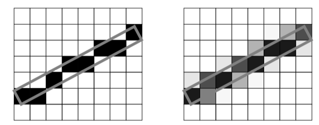

# Anti-Aliasing


In VTK , anti-aliasing can be implemented in C++ using various approaches. Anti-aliasing is essential to smooth out the jagged edges that occur in raster graphics due to the limitation of screen resolution. Here's a synthesis of the methods available:

1. **Multi-Sampling**: You can enable multi-sampling directly in the `vtkRenderWindow` class, which can help reduce the aliasing effect. This is done by calling the `SetMultiSamples()` method on the render window object, typically with a value like 4 to set the number of samples per pixel [1](https://discourse.vtk.org/t/how-to-anti-alias-in-vtkrenderwindow/4556#:~:text=Then%20you%20call%3A%20vtkwidget,motion%20blur%20and%20focal%20depth).

2. **Accumulation Buffer**: Another approach uses an accumulation buffer to average several possibly aliased images to produce an anti-aliased result. An accumulation buffer is a section of memory used for image operations and storage. You can jitter the camera and focal point by less than one pixel, render multiple images, and then add these images to the accumulation buffer. After rendering all images, you divide the accumulation buffer by the total number of images to get the anti-aliased image [2](https://examples.vtk.org/site/VTKBook/07Chapter7/#:~:text=The%20last%20method%20of%20anti,C%2B%2B%20code%20illustrates%20this%20process), [3](https://examples.vtk.org/site/VTKBook/07Chapter7/). 

Here is a pseudo-code representation of this process:
   ```cpp
   for (imageNum = 0; imageNum < imageTotal; imageNum++) {
     // Jitter the camera and focal point by less than one pixel
     // Render an image
     // Add the image to the accumulation buffer
   }
   // Divide the accumulation buffer by imageTotal
   // Display the resulting anti-aliased image
   ```
   This method is computationally more intensive as it involves rendering the scene multiple times with slight variations【13†source】.

3. **Camera and Focal Point Translation**: In a related approach, you can use several images without sub-pixels and achieve anti-aliasing by translating the camera's position and focal point slightly between each image. The translations should be small and perpendicular to the projection direction. This technique requires careful calculation of the new camera positions to avoid issues with the transformation matrix at the camera's position [3](https://examples.vtk.org/site/VTKBook/07Chapter7/).

4. **FXAA (Fast Approximate Anti-Aliasing)**: VTK also supports FXAA, a fast shader-based anti-aliasing technique. In ParaView, which uses VTK, FXAA can be enabled in the settings dialog under Render View >> Antialiasing Options. While this is specific to ParaView, the underlying VTK support for FXAA can be leveraged in a custom C++ application using VTK. The settings for FXAA can be adjusted for different balances between quality and performance [4](https://www.kitware.com/new-fxaa-anti-aliasing-option-in-paraviewvtk/#:~:text=FXAA%20Settings,effect%20on%20the%20final%20image).

When choosing a method, you should consider the performance impact and the visual quality you require. Multi-sampling is relatively easy to implement and provides a good balance for most applications. Accumulation buffer techniques are more flexible and can produce high-quality results but are more memory and computation-intensive. FXAA is a good option when shader support is available, and performance is a critical factor.


A one pixel wide line (outlined in gray) draw using a winner take all approach (left) and a coverage approach (right)
  

[image courtesy](https://examples.vtk.org/site/VTKBook/07Chapter7/). 


Refs: [1](https://discourse.vtk.org/t/how-to-anti-alias-in-vtkrenderwindow/4556)
