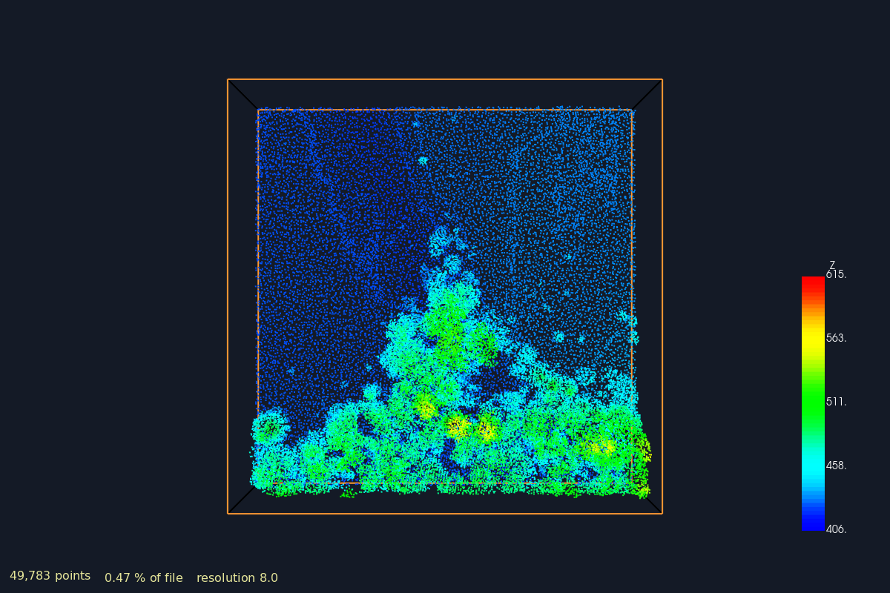
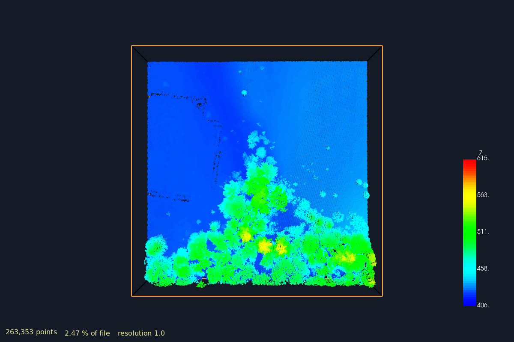

# LAZ, COPC, PDAL, octrees, LOD, and the VTK camera

How a 500 GB point cloud becomes 2 million points on screen, and which layer of
the stack is responsible for each step.

Code in this repo:

| Target | File | What it shows |
|---|---|---|
| `create_copc_in_memory` | [src/create_copc_in_memory.cpp](../src/create_copc_in_memory.cpp) | Build a `PointView` in memory, write it as COPC, read one bounds box back |
| `copc_lod_queries` | [src/copc_lod_queries.cpp](../src/copc_lod_queries.cpp) | Same bounds, five different `resolution` values — the LOD pyramid made numeric |
| `camera_lod_COCP` | [src/camera_lod_COCP.cpp](../src/camera_lod_COCP.cpp) | The VTK side: camera, focal point, frustum planes, projected pixel size → LOD level |
| `copc_hierarchy_inspect` | [src/copc_hierarchy_inspect.cpp](../src/copc_hierarchy_inspect.cpp) | **No dependencies.** Reads the octree index out of the file and costs a query before running it — §8 |
| `copc_partial_load_vtk` | [src/copc_partial_load_vtk.cpp](../src/copc_partial_load_vtk.cpp) | Load one box at one LOD into a `vtkPolyData` and render it — §9 |
| `copc_camera_streaming` | [src/copc_camera_streaming.cpp](../src/copc_camera_streaming.cpp) | The closed loop: the camera derives both the bounds and the resolution — §10 |
| *(python)* | [python/copc_hierarchy_inspect.py](../python/copc_hierarchy_inspect.py) | Same inspector in Python, **and it works over HTTP** on a remote file — §8a |
| *(python)* | [python/copc_partial_load_vtk.py](../python/copc_partial_load_vtk.py) | Partial load + VTK in Python: URLs, predicted-vs-actual cost, offscreen PNGs — §9a |

The PDAL targets need `-DUSE_PDAL=ON`; PDAL must be installed *before* VTK is
configured (see [README](../README.md)). `camera_lod_COCP` is pure VTK.
`copc_hierarchy_inspect` needs nothing at all — `g++ -std=c++17 -O2 -o
copc_hierarchy_inspect src/copc_hierarchy_inspect.cpp` and it runs.

> **If one question brought you here — "where do the levels of detail come
> from?" — the short answer is: from the file.** A COPC file stores one number,
> the root node spacing, and level *d* has spacing `rootSpacing / 2^d`. The
> writer fixed that ladder when the file was created. PDAL does not invent it,
> VTK does not invent it, and your viewer does not invent it. The only thing a
> viewer chooses is **which rungs to fetch**, and §10 shows that choice being
> derived from nothing but the camera. Run `copc_hierarchy_inspect` on any COPC
> file to see the ladder printed out (§8).

---

## 0. The whole picture in one diagram

```
 DISK / HTTP                    PDAL                          VTK
 ───────────                    ────                          ───

 big.copc.laz
 ┌──────────────────┐
 │ LAS header       │
 │ COPC info VLR    │──┐
 │ COPC hierarchy   │  │  "which byte range
 │   VLR (octree    │  │   holds node 3-4-2-1?"
 │   index)         │  │
 ├──────────────────┤  │       readers.copc
 │ chunk 0  (node   │  │       ┌─────────────────┐
 │          0-0-0-0)│  └──────▶│ walk hierarchy  │
 │ chunk 1  (node   │          │ cull by bounds  │      vtkPoints
 │          1-0-0-0)│◀─ range ─│ stop at depth   │      vtkPolyData
 │ chunk 2  ...     │  reads   │ (resolution)    │──▶   vtkPolyDataMapper
 │ ...              │          │ LAZ-decompress  │      vtkActor
 │ chunk N          │          └─────────────────┘         │
 └──────────────────┘                  ▲                   │
                                       │                   ▼
                              bounds + resolution      vtkRenderer
                                       │                   │
                                       └───────────────────┘
                                   camera position / focal point /
                                   frustum planes / screen-space error
```

The loop is closed: **the camera decides what to ask PDAL for, PDAL decides
which bytes to read, VTK draws the result, and drawing moves the camera again.**

---

## 1. LAS — the container

LAS is a simple binary format from ASPRS. Three parts:

```
┌─────────────────────────────────────┐
│ Public header block (fixed fields)  │  version, point format, point count,
│                                     │  scale/offset, min/max X Y Z, offset
├─────────────────────────────────────┤  to point data
│ Variable Length Records (VLRs)      │  CRS (WKT/GeoTIFF), classification
│                                     │  lookup, and *anything custom*
├─────────────────────────────────────┤
│ Point data records (fixed stride)   │  N × sizeof(record)
├─────────────────────────────────────┤
│ Extended VLRs (EVLRs)               │
└─────────────────────────────────────┘
```

A point record is a fixed-size struct. Which fields exist is chosen by the
*point data record format* (0–10). Format 6 for instance carries:

```
X, Y, Z            int32, multiplied by scale + offset from the header
Intensity          uint16
Return Number, Number of Returns
Classification     uint8  (2 = ground, 5 = high vegetation, 6 = building, ...)
Scan Angle, User Data, Point Source ID
GPS Time           double
```

Two things matter downstream:

1. **X/Y/Z are stored as scaled integers.** The header holds
   `scale = (0.01, 0.01, 0.01)` and `offset = (500000, 5400000, 0)`; the real
   coordinate is `value * scale + offset`. This is why LAS compresses so well
   and why you sometimes see coordinates quantized to 1 cm.
2. **The record is fixed-stride**, so point *i* is at a computable file offset —
   but there is no relationship between file order and spatial position. Point
   *i* and point *i+1* can be kilometres apart.

## 2. LAZ — the compression

LAZ (LASzip) is lossless compression of the LAS point records. It is not gzip
over the file; it is a format-aware arithmetic coder that predicts each field
from the previous point (delta-encode X, Y, Z; the classification rarely
changes; GPS time is monotonic). Typical 5–10× reduction.

Crucially LAZ is **chunked**: points are grouped (default 50 000 per chunk) and
each chunk is independently decompressible. A chunk table at the end of the file
lists each chunk's byte offset.

```
LAZ file:
 [hdr][chunk 0][chunk 1][chunk 2] ... [chunk N][chunk table]
        50k pts  50k pts  50k pts
```

So random access exists — but only by *chunk index*, and chunk index means
nothing spatially. To find every point in a 100 m box you still have to
decompress the entire file. **This is exactly the gap COPC fills.**

## 3. COPC — LAZ chunks reorganized into an octree

COPC (Cloud Optimized Point Cloud) changes no bytes of the LAZ codec. It makes
two additions:

1. **Each LAZ chunk is exactly one octree node.** The points are reordered
   before writing so that this holds.
2. **Two VLRs describe the octree:** a `copc info` VLR (root cube centre and
   half-size, root node spacing, offset to the root hierarchy page) and one or
   more `copc hierarchy` VLRs, each a flat array of entries:

```
struct Entry {          // 32 bytes
    VoxelKey key;       // level, x, y, z   (4 × int32)
    uint64   offset;    // byte offset of this node's LAZ chunk
    int32    byteSize;  // compressed size
    int32    pointCount;// > 0 = node, 0 = empty, -1 = this key is a child page
};
```

That `-1` case is what makes the index itself lazy: the hierarchy is paged, so a
client does not download the index for a region it never looks at.

A reader therefore needs: **one range request for the header + info VLR, one for
the root hierarchy page, then one range request per node it decides to draw.**
Over HTTP that is plain `Range:` headers — no server software, just a static
file on S3. That is the entire point of "cloud optimized".

### The VoxelKey and the cube

```
level 0:                ┌───────────────┐
  key (0,0,0,0)         │               │   one cube covering the whole
  spacing = s           │       •       │   dataset (cubic, not the bbox)
                        │               │
                        └───────────────┘

level 1:                ┌───────┬───────┐
  keys (1,x,y,z)        │ •  •  │ •  •  │   8 children, each half the edge
  x,y,z ∈ {0,1}         ├───────┼───────┤   spacing = s/2
  spacing = s/2         │ •  •  │ •  •  │
                        └───────┴───────┘

level 2:                ┌───┬───┬───┬───┐
  spacing = s/4         │•·•│•·•│•·•│•·•│   64 children
                        ├───┼───┼───┼───┤   spacing = s/4
                        │•·•│•·•│•·•│•·•│
                        ├───┼───┼───┼───┤
                        │•·•│•·•│•·•│•·•│
                        ├───┼───┼───┼───┤
                        │•·•│•·•│•·•│•·•│
                        └───┴───┴───┴───┘
```

The bounds of a node are pure arithmetic from the key and the root cube — no
lookup needed:

```cpp
double size = rootSize / (1 << key.level);
minx = rootMinX + key.x * size;   maxx = minx + size;
// same for y, z
```

### The one idea that makes LOD work: nodes are *additive*, not a partition

This is the part people get wrong. In a classic spatial index (an R-tree, a
kd-tree), all the data lives in the leaves and the internal nodes are just
routing. In COPC/EPT/Potree, **every node holds real points**, and a node's
points are a *thinned sample* of everything below it, at that node's spacing.

```
level 0  ·     ·     ·     ·        ~65k pts, 1 pt every 2.0 m
level 1  · ·  · ·  · ·  · ·         ~65k pts/node, 1 pt every 1.0 m
level 2  ·············               ~65k pts/node, 1 pt every 0.5 m
level 3  ···············             ~65k pts/node, 1 pt every 0.25 m

what you draw = level 0  ∪  level 1  ∪  level 2  ∪  ...
```

Consequences you can rely on:

* Every node holds roughly the **same number of points** (the chunk budget).
  Cost per node is constant; cost is proportional to *node count*, which is what
  makes budgeting a frame possible.
* Refinement is **incremental**. Descending one level does not invalidate what
  you already drew — you *add* to it. A viewer can render level 0 instantly and
  keep appending, and nothing ever flickers or has to be re-fetched.
* **Spacing halves per level**: `spacing(d) = rootSpacing / 2^d`. That is the
  bridge from "how many pixels is this on screen" to "which level do I need".

The root spacing is stored in the COPC info VLR. If a converter targets ~65 000
points per node in a `32×32×32`-ish voxel grid, `rootSpacing ≈ rootCubeSize/32`.

---

## 4. PDAL — the abstraction over all of it

PDAL is a pipeline library: **stages** connected into a DAG, moving points
through a **PointTable**.

```
readers.copc  ──▶  filters.range  ──▶  filters.reprojection  ──▶  writers.las
  (source)          (classify=2)         (EPSG:25832)             (sink)
```

Three objects to know:

| Object | Role |
|---|---|
| `PointTable` | Owns the buffer and the `PointLayout` — which dimensions exist and their types |
| `PointLayout` | Registry of `Dimension::Id::X`, `Y`, `Z`, `Intensity`, `Classification`, … plus user dimensions |
| `PointView` | A *view*: a list of point ids into a table. `execute()` returns a `PointViewSet` |

Points are accessed by (dimension, id), not as structs:

```cpp
double x = view->getFieldAs<double>(pdal::Dimension::Id::X, i);
view->setField(pdal::Dimension::Id::Z, i, 0.0);
```

This columnar model is why PDAL can add a dimension mid-pipeline without
touching the reader, and why the same filter code works on LAS, PLY, E57 or a
database.

### What `readers.copc` actually does with your options

```cpp
options.add("filename",   "big.copc.laz");
options.add("bounds",     "([100,200],[300,400])");   // X range, Y range (Z free)
options.add("resolution", 5.0);                        // metres between points
```

Inside, roughly:

```
read header + copc info VLR
read root hierarchy page
queue ← root node
while queue not empty:
    node ← pop
    if node.bbox does not intersect `bounds`:      skip subtree
    if spacing(node.level) < requested resolution: skip subtree   ← the LOD cut
    if node.pointCount == -1:  fetch that child hierarchy page, re-queue
    else:
        range-read [node.offset, node.offset+node.byteSize)
        LAZ-decompress into the PointView
        push node's 8 children
```

Two independent prunings — **`bounds` prunes in space, `resolution` prunes in
depth** — and both happen *before* any decompression. That is the whole win.

Note `resolution` is a *point spacing in dataset units*, not a level number and
not a point count. The traversal stops descending once a node is already finer
than you asked for, so the returned count is "whatever the octree had at or
above that spacing" — which is why the numbers in `copc_lod_queries` are not
round.

### `copc_lod_queries` makes this visible

[src/copc_lod_queries.cpp](../src/copc_lod_queries.cpp) writes a 1000×1000 grid
(1 M points, 1 m spacing, `z = 20·sin(0.02x)·cos(0.02y)`), converts CSV → COPC
via `readers.text → writers.copc`, then queries the *same* 100×100 m box five
times, changing only `resolution`:

```
resolution 20 m ──┐
resolution 10 m   │   identical bounds ([100,200],[300,400])
resolution  5 m   ├── only the depth cut moves
resolution  2 m   │
no resolution   ──┘   full detail
```

Expect roughly a 4× rise in point count per halving of the resolution (area
scales as spacing⁻² for a 2.5 D surface). Run it and read the five numbers — that
table *is* the LOD pyramid.

### `create_copc_in_memory` — the write path

[src/create_copc_in_memory.cpp](../src/create_copc_in_memory.cpp) shows the
other direction: you already have points in memory and want COPC out.

The trick is that a writer needs an upstream *Stage*, not a `PointView`. The
adapter is `BufferReader`:

```cpp
pdal::BufferReader buffer;
buffer.addView(view);          // wrap the in-memory view as a source stage
writer->setInput(buffer);
writer->prepare(table);
writer->execute(table);
```

`writers.copc` does the expensive part — it builds the octree, subsamples each
node to its spacing, orders the chunks, and writes the hierarchy VLRs. Note this
example's Z is constant 0, so the octree degenerates into a quadtree; make Z
vary if you want to see real 3 D node splitting.

---

## 5. Potree, EPT, COPC — same idea, three packagings

All three descend from Entwine's EPT. They differ only in how the octree is
stored on disk.

| | Layout | Index | Best at |
|---|---|---|---|
| **EPT** | one file per node (`ept-data/0-0-0-0.laz`) + JSON hierarchy | JSON files | Simple, but millions of tiny files |
| **Potree 2.0** | 3 files: `octree.bin`, `hierarchy.bin`, `metadata.json` | binary hierarchy, paged | Browser streaming; native viewer format |
| **COPC** | **one** `.copc.laz`, valid LAZ for any LAS reader | VLRs inside the file | Archival + cloud; nothing to unpack |

The killer property of COPC is **backward compatibility**: `big.copc.laz` opens
in any LAS/LAZ reader on earth, which sees a normal (oddly ordered) point cloud
and ignores the two VLRs. Potree 2.0's `octree.bin` opens in nothing.

So, in practice:

* **COPC** = storage and interchange. Serve it from S3, done.
* **Potree** = a *viewer* (and its converter). Potree 2.0 can load COPC directly
  now, so you often skip PotreeConverter entirely.
* **PDAL** = the tool that reads and writes all of them, plus 30 other formats.

**VTK's octrees are not in this family at all.** `vtkOctreePointLocator`,
`vtkIncrementalOctreePointLocator` ([docs/octree.md](octree.md)),
`vtkHierarchicalBinningFilter` ([docs/hierarchical_binning_filter.md](hierarchical_binning_filter.md))
are *in-memory* structures built from a `vtkPolyData` you already loaded, for
nearest-neighbour and radius queries. They index what is in RAM; COPC indexes
what is on disk. Building a `vtkOctreePointLocator` does not give you COPC, and
reading COPC does not give you a locator.

---

## 6. The VTK camera — where the LOD decision comes from

[src/camera_lod_COCP.cpp](../src/camera_lod_COCP.cpp) is the other half. It has
no PDAL in it: it isolates the viewer-side question, *given where the camera is,
how much detail do I need?*

### Position, focal point, view up

```
                         view up
                            ▲
                            │
    camera position ●───────┼──────────────────▶ ● focal point
       (the eye)      direction of projection      (the aim point
                            │                       AND the pivot)
                       ┌────┴────┐
                       │ frustum │
```

* **Position** — the eye, in world coordinates.
* **Focal point** — what the camera looks at. `direction = focal − position`.
* **View up** — roll; which way is up in the image.
* **View angle** — vertical field of view in degrees (default 30°).
* **Clipping range** — near and far distances along the view direction.
* **Distance** = `|focal − position|`, the single number that drives LOD.

`vtkInteractorStyleTrackballCamera` **rotates the camera around the focal
point**. Not around the origin, not around the object — around whatever the
focal point currently is. Pan moves position *and* focal point together; dolly
moves position toward the focal point; `Zoom` changes the view angle instead.
This is why "the object spins off screen" bugs are almost always a focal point
left somewhere stale. See also [docs/camera_position.md](camera_position.md) and
[docs/modify_renderer_camera.md](modify_renderer_camera.md).

The demo makes the pivot literal:

| Visual | Meaning |
|---|---|
| Red sphere + billboard label | current focal point = rotation pivot |
| Yellow line | camera position → focal point |
| Green wireframe | the frustum, from `GetFrustumPlanes` |
| Axes at origin | world reference, so you can see the pivot move away from it |

Drag to rotate: the sphere stays put. Middle-drag to pan: the sphere moves with
you, because the callback re-reads the focal point on every `ModifiedEvent` and
calls `SetCenter`/`SetPosition`/`SetPoint1`/`SetPoint2`.

### Frustum planes

```cpp
double planes[24];
camera->GetFrustumPlanes(aspect, planes);   // 6 planes × (A,B,C,D)
```

Six planes as `Ax + By + Cz + D = 0`, **normals pointing inward** — so a point is
inside the frustum iff all six give `Ax+By+Cz+D ≥ 0`.

The order is a classic trap, and the demo gets it right:

```
index 0  LEFT    (-x)
index 1  RIGHT   (+x)
index 2  BOTTOM  (-y)
index 3  TOP     (+y)
index 4  FAR     (-z)     ← far before near, not near before far
index 5  NEAR    (+z)
```

`aspect` must be the viewport's width/height or the left/right planes are wrong.
More in [docs/frustum.md](frustum.md) and
[docs/point_visibility_in_camera_frustum.md](point_visibility_in_camera_frustum.md).

Feed them back into geometry with `vtkPlanes::SetFrustumPlanes` +
`vtkFrustumSource` (what draws the green box), or use them to test a node's AABB
— see §7.

### Projected size: world metres → screen pixels

The one formula that connects the 3D world to the LOD level:

```
                                      height_pixels
   pixels  =   worldSize / distance  ×  ───────────────────
                                        2 · tan(fov/2)
```

```cpp
projectedPixels = (ObjectWorldSize / distance) *
                  (height / (2.0 * std::tan(viewAngleRad * 0.5)));
```

Read it as two factors: `worldSize/distance` is the angular size in radians;
`height / (2·tan(fov/2))` is the **focal length in pixels**, a constant for a
given window and FOV. Multiply and you have pixels. (Perspective only — for
`ParallelProjectionOn`, the size is `worldSize / (2·ParallelScale) × height`,
independent of distance.)

Then the policy step, `SelectCopcLOD`:

```
< 30 px  → level 0        < 240 px → level 3
< 60 px  → level 1        < 480 px → level 4
< 120 px → level 2        < 960 px → level 5
                          else     → level 6
```

Doubling thresholds because spacing halves per level — one extra level per
doubling of on-screen size. **This is viewer policy, not part of the COPC
spec.** Nothing in COPC says which level you should draw.

The honest way to say the same thing is **screen-space error**: how many pixels
apart are the points of level *d* when drawn?

```
pixelError(d) = spacing(d) / distance × focalLengthPixels
              = (rootSpacing / 2^d) / distance × focalLengthPixels

descend while pixelError(d) > targetError      (target ≈ 1–3 px)
```

Solve for *d* directly and you get the level in one step instead of a ladder of
`if`s. That formulation also generalizes per node, which is what you actually
want — a node near the camera and a node at the horizon need different depths in
the same frame.

### What the demo deliberately leaves out

Worth knowing so you are not surprised:

* There is no COPC in `camera_lod_COCP` — it prints an LOD number, it does not
  fetch anything. (The filename also spells it `COCP`.)
* `ObjectWorldSize` is a fixed 10.0 for the whole scene; a real viewer uses each
  *node's* bbox size and its own distance.
* The green frustum is built once at startup and never updated — `FrustumActor`
  is stored on the callback but unused. It shows the *initial* frustum, which is
  actually what you want for a teaching demo (fly outside it and look back), but
  it is not "the current frustum".
* The frustum planes are recomputed and printed every `ModifiedEvent`, including
  during a drag. That is a lot of `cout` — fine here, never in production.

---

## 7. Putting it together: the streaming loop

VTK gives you no streaming point-cloud reader. `vtkLODActor`, `vtkLODProp3D`
and `vtkQuadricLODActor`
([docs/actor_multiple_levels_of_detail.md](actor_multiple_levels_of_detail.md),
[docs/high_resolution_low_resolution_actor.md](high_resolution_low_resolution_actor.md))
swap between representations you have *already built in RAM* while the user
interacts. Useful, but orthogonal: they solve "don't draw 50 M points at 60 fps",
not "don't load 50 M points". The out-of-core part is yours to write.

The shape of it:

```cpp
// once
copc::Reader reader("big.copc.laz");        // or PDAL's readers.copc
std::unordered_map<VoxelKey, vtkSmartPointer<vtkActor>> loaded;

// on camera ModifiedEvent (debounced — see below)
void updateLOD()
{
    double planes[24];
    camera->GetFrustumPlanes(aspect, planes);
    double focalLenPx = height / (2.0 * std::tan(viewAngleRad * 0.5));

    std::vector<VoxelKey> wanted;
    std::queue<VoxelKey> q{{rootKey}};

    while (!q.empty())
    {
        VoxelKey k = q.front(); q.pop();
        Bounds b = boundsOf(k);                       // arithmetic, no I/O

        if (!aabbIntersectsFrustum(b, planes)) continue;   // spatial cull

        double dist = distanceTo(b, cameraPosition);
        double err  = (rootSpacing / (1 << k.level)) / dist * focalLenPx;

        wanted.push_back(k);
        if (err > targetPixelError && k.level < maxLevel)
            for (auto c : childrenOf(k))
                if (hierarchyHasNode(c)) q.push(c);        // hierarchy cull
    }

    budget(wanted, maxPointsPerFrame);         // sort by error, cut the tail

    for (auto k : wanted)
        if (!loaded.count(k))
            enqueueLoad(k);                    // worker thread: range-read,
                                               // decompress, build vtkPolyData
    for (auto& [k, actor] : loaded)
        if (!wanted.contains(k)) renderer->RemoveActor(actor);   // or keep cached
}
```

The AABB-vs-frustum test, with inward normals:

```cpp
bool aabbIntersectsFrustum(const Bounds& b, const double p[24])
{
    for (int i = 0; i < 6; ++i)
    {
        const double *n = p + i*4;
        // the box corner furthest along the inward normal
        double x = (n[0] >= 0) ? b.maxx : b.minx;
        double y = (n[1] >= 0) ? b.maxy : b.miny;
        double z = (n[2] >= 0) ? b.maxz : b.minz;
        if (n[0]*x + n[1]*y + n[2]*z + n[3] < 0)
            return false;              // entirely outside this plane
    }
    return true;
}
```

Practical rules learned the hard way:

* **One actor per node.** It makes add/remove trivial and lets VTK's own frustum
  culling ([docs/culling.md](culling.md)) do a second pass for free.
* **Never load on the camera callback thread.** A range read plus LAZ
  decompression is tens of milliseconds; doing it inline turns a smooth drag
  into a slideshow. Queue the keys, load on a worker, hand finished
  `vtkPolyData` back on the main thread, `Render()`.
* **Debounce.** `ModifiedEvent` fires many times per drag. Recompute the wanted
  set on a timer (say 100 ms) or on `EndInteractionEvent`, not on every event.
* **Cache, don't free.** Keep dropped nodes in an LRU. Rotating back and forth
  should hit RAM, not the network.
* **Budget by error.** Sort `wanted` by descending pixel error and cut at a
  point count you can draw. Frame time is what you are actually defending.
* **Prefetch coarse first.** Loading level 0 → 1 → 2 gives the user something
  immediately; loading deepest-first gives them a blank screen then a pop.
* If you go through PDAL rather than a COPC library directly, you get the same
  effect one query at a time: convert the frustum to a bbox, pick a resolution
  from the nearest point of that bbox, issue one `readers.copc` execute. Less
  precise than per-node traversal, far less code.

---

## 8. Worked example: reading the LOD ladder out of a real file

**`copc_hierarchy_inspect`** — [src/copc_hierarchy_inspect.cpp](../src/copc_hierarchy_inspect.cpp)

If only one thing in this document gets run, make it this one. It answers the
question *"who decides the levels?"* by showing you that **they are already in
the file**. It has **no dependencies at all** — no PDAL, no VTK, no LAZ decoder —
because it never decompresses a point. It reads the LAS header, the `copc info`
VLR at its fixed offset, and the hierarchy pages. That is it.

```
g++ -std=c++17 -O2 -o copc_hierarchy_inspect src/copc_hierarchy_inspect.cpp
```

Get a real file to point it at:

```
curl -LO https://raw.githubusercontent.com/PDAL/PDAL/master/test/data/copc/lone-star.copc.laz
./copc_hierarchy_inspect lone-star.copc.laz
```

Real output, trimmed:

```
=== LAS HEADER ===============================================
LAS version          : 1.4
Point record format  : 6  (LAZ compressed)
Number of points     : 518862
File size            : 2705193 bytes (2.580 MB)
Scale                : 0.000250000, 0.000250000, 0.000250000
Bounding box X       : 515368.602 ... 515401.043   (32.441 wide)
Bounding box Y       : 4918340.364 ... 4918381.124   (40.760 wide)
Bounding box Z       : 2322.896 ... 2338.575   (15.679 wide)

-> All of the above came from the first 375 bytes.
```

**That is the first thing to internalize about partial loading.** The extent and
the point count of a 500 GB cloud cost 375 bytes to learn. A viewer can place its
camera, size its grid and plan its first query before touching any point data.

```
=== COPC INFO VLR ============================================
Root cube center     : 515388.9821, 4918360.7439, 2343.2761
Root cube halfsize   : 20.3799
Root cube extent     : 515368.6022 ... 515409.3620  (cubic in X, Y and Z)
Root node spacing    : 0.3184   <-- the base of the LOD ladder
Hierarchy at         : offset 2704713, 480 bytes
```

**This is the answer to "how is the LOD set".** One number — `spacing` — in a
160-byte VLR. Everything else is `spacing / 2^level`:

```
  level    spacing
  -----    ---------
      0       0.3184
      1       0.1592
      2       0.0796
      3       0.0398
      4       0.0199
      5       0.0100
```

Nobody at render time picks these. **The COPC writer picked them when the file was
created**, by choosing a target points-per-node, and they are then fixed forever.
A viewer's only freedom is *which levels to fetch* — never what the levels are.

Then the octree contents, read from the 480-byte hierarchy page:

```
=== OCTREE CONTENTS ==========================================
Hierarchy pages read : 1
Nodes with points    : 15

 level   nodes      points    spacing   avg pts/node   cumulative pts
 -----   -----   ---------   --------   ------------   --------------
     0       1       58393     0.3184          58393            58393
     1       4      105600     0.1592          26400           163993
     2      10      354869     0.0796          35486           518862

Total points in octree : 518862
Header point count     : 518862
```

The last two lines agreeing is the proof that the parse is right: every point in
the file is accounted for by exactly one node.

Read the `cumulative` column as the LOD pyramid. Draw level 0 only → 58 393
points, 11 % of the file, and you already have a recognizable cloud. Add level 1
→ 163 993. Add level 2 → everything. **Additive, never redundant.**

### The query simulator — partial loading, costed in advance

The `--bounds` and `--resolution` flags make the program walk the node list and
tell you what a query *would* cost, still without decompressing anything:

```
$ ./copc_hierarchy_inspect lone-star.copc.laz \
      --bounds 515370,515380,4918340,4918350 --resolution 0.1

=== SIMULATED QUERY ==========================================
bounds     : ([515370.000,515380.000],[4918340.000,4918350.000])
resolution : 0.100
-> deepest level needed : 2  (spacing 0.080)

Nodes touched        : 2 of 15
  culled by bounds   : 13
  culled by depth    : 0

Points in those nodes: 91302 of 518862   (17.60 %)
Bytes read           : 591170 of 2705193   (21.85 %)
Range requests       : 4   (header + root hierarchy page + one per node)
```

**13 of 15 nodes were eliminated by arithmetic on their keys.** Their bytes were
never touched. Over HTTP this is 4 range requests against a static file.

> **A node is the smallest unit of I/O, and that is not the same as the answer.**
> `points in those nodes` is an *upper bound*: you always decompress whole
> nodes, and then PDAL (or laspy) **crops** the result to your box. For this
> query laspy actually returns **7 360** points, not 91 302 — the box is small
> next to a level-0 node that spans the entire dataset. The number that is
> exact, and the one that actually costs you, is `bytes read`. Run the Python
> version with `--load` to see both side by side.

Now hold the bounds still (the whole extent this time) and move only
`resolution`, and you can watch the depth cut do its work:

```
resolution 0.35  ->  level 0    58393 pts (11.25 %)    431475 bytes (15.95 %)
resolution 0.2   ->  level 1   163993 pts (31.61 %)   1061773 bytes (39.25 %)
resolution 0.1   ->  level 2   518862 pts (100.0 %)   2703294 bytes (99.93 %)
no resolution    ->  all       518862 pts (100.0 %)   2703294 bytes (99.93 %)
```

(Bounds here are the whole extent, so no cropping happens and the point counts
are exact.)

Two knobs, two independent prunings:

| Knob | Prunes | Mechanism |
|---|---|---|
| `bounds` | **in space** | node AABB (computed from the key) vs. the query box |
| `resolution` | **in depth** | `spacing/2^level` vs. the requested spacing |

Both are decided from the index alone, *before* any I/O on point data. That is
the whole trick, and there is nothing more to it.

---

## 8a. The same thing in Python — and over HTTP

**`python/copc_hierarchy_inspect.py`** — the twin of the C++ inspector, plus the
one capability that is awkward in C++ and trivial here: **it works on a URL.**

The core needs **nothing but the standard library**, so it runs in Anaconda's
`base` with no install:

```
python python/copc_hierarchy_inspect.py lone-star.copc.laz
```

Only the optional `--load` flag needs packages:

```
conda env create -f python/environment.yml && conda activate copc
# or, into an env you already have:
conda install -c conda-forge laspy lazrs numpy python-pdal vtk
```

### Inspecting a remote file without downloading it

Every read goes through a `ByteSource` that counts bytes and requests, and the
HTTP implementation is just a `Range:` header. Point it at an 81 MB file on S3:

```
$ python python/copc_hierarchy_inspect.py \
    https://s3.amazonaws.com/hobu-lidar/autzen-classified.copc.laz
```

```
Number of points     : 10,653,336
File size            : 81,123,042 bytes (77.36 MB)

Root node spacing    : 36.3712   <-- the base of the LOD ladder

 level   nodes       points    spacing   avg pts/node   cumulative
 -----   -----   ----------   --------   ------------   ----------
     0       1       61,201    36.3712         61,201       61,201
     1       4       69,859    18.1856         17,464      131,060
     2      12      446,577     9.0928         37,214      577,637
     3      48    1,504,879     4.5464         31,351    2,082,516
     4     192    8,380,771     2.2732         43,649   10,463,287
     5      21      190,049     1.1366          9,049   10,653,336

Total points in octree : 10,653,336
Header point count     : 10,653,336
-> they match, so every point is accounted for by exactly one node.

=== WHAT THIS SCRIPT ACTUALLY READ ===========================
Requests             : 2
Bytes read           : 9,485 of 81,123,042  (0.0117 %)
Points decompressed  : 0
```

**Two HTTP requests and 9,485 bytes** bought the complete octree structure of a
10.6-million-point cloud: how many levels, how many nodes, where each one is in
space, and what each costs to fetch. Against a *static file* — no server
software, no database, no tiling step. That is the whole deployment story for
COPC, and it is the concrete difference from a plain `.laz`, which would have
required all 81 MB.

Note the shape of that table, because it is typical and the C++ example's tiny
file does not show it: levels 0–3 together are under 20 % of the points. A
viewer can draw a perfectly recognizable Autzen stadium from ~2 M points while
the remaining 8.4 M stream in — or never load at all if the camera stays far
away.

### `--ladder`: every LOD at once

```
$ python python/copc_hierarchy_inspect.py <url> \
      --ladder --bounds 636000,636500,850000,850500

 resolution    level    node points    % of file        bytes   % of file
 ----------    -----   ------------   ----------   ----------   ---------
    36.3712        0         61,201        0.57 %      763,258       0.94 %
    18.1856        1         86,830        0.82 %    1,093,022       1.35 %
     9.0928        2        165,338        1.55 %    1,902,701       2.35 %
     4.5464        3        313,282        2.94 %    3,242,517       4.00 %
     2.2732        4        768,175        7.21 %    6,526,749       8.05 %
     1.1366        5        812,085        7.62 %    6,897,746       8.50 %
     (none)      all        812,085        7.62 %    6,897,746       8.50 %
```

A 500 × 500 m window of a 3.4 × 4.6 km cloud, at six detail levels: from 0.57 %
of the file to 7.6 %. **Both knobs are working at once here** — the bounds cut
it to that window, the resolution picks the rung.

### `--load`: check the prediction against reality

```
$ python python/copc_hierarchy_inspect.py lone-star.copc.laz \
      --bounds 515370,515380,4918340,4918350 --resolution 0.1 --load

Points in those nodes: 91,302 of 518,862   (17.60 %)
Bytes to read        : 591,170 of 2,705,193   (21.85 %)

=== ACTUAL LOAD (laspy) ======================================
laspy returned       : 7,360 points
actual X range       : 515370.000 ... 515380.000
actual Y range       : 4918345.074 ... 4918349.999
numpy array          : (7360, 3), 0.17 MB
```

**91,302 predicted, 7,360 returned — and both are right.** This is the
distinction that trips people up:

| Figure | What it is |
|---|---|
| `bytes to read` | **Exact.** Whole LAZ chunks. This is what leaves the disk or the network. |
| `points in those nodes` | **Upper bound.** Everything inside the chunks you had to decompress. |
| what laspy/PDAL returns | The subset of those that actually fall inside your box. |

A node is the smallest unit of I/O, so you pay for whole nodes and *then* crop.
Here the box is 10 × 10 m while the level-0 node spans the entire 40 m dataset,
so almost everything read gets discarded. **Make your query boxes comparable to
the node size** and the gap closes; ask for a 1 m box out of a 4 km cloud and
you will decompress a great deal to keep very little.

`--json` emits the same structure machine-readably, which is the useful form if
you are picking LODs in a pipeline rather than reading them.

---

## 9. Worked example: load one box into VTK and nothing else

**`copc_partial_load_vtk`** — [src/copc_partial_load_vtk.cpp](../src/copc_partial_load_vtk.cpp)
(needs `-DUSE_PDAL=ON`)

This is the practical version of the same thing: PDAL does the traversal, and
the points land in a `vtkPolyData`.

```
# header only -- extent and count, no points
./copc_partial_load_vtk big.copc.laz --info

# one box, full detail
./copc_partial_load_vtk big.copc.laz --bounds 515370,515390,4918350,4918370

# same box, coarse
./copc_partial_load_vtk big.copc.laz --bounds 515370,515390,4918350,4918370 --resolution 0.5

# the same box at five LODs, no window
./copc_partial_load_vtk big.copc.laz --fraction 0.2 --ladder
```

The partial load is four PDAL calls. This is genuinely all of it:

```cpp
pdal::Stage *reader = factory.createStage("readers.copc");

pdal::Options options;
options.add("filename", filename);
options.add("bounds",   "([515370,515390],[4918350,4918370])");  // WHERE
options.add("resolution", 0.5);                                   // HOW DETAILED
reader->setOptions(options);

pdal::PointTable table;
reader->prepare(table);
pdal::PointViewSet views = reader->execute(table);
```

`execute()` returns only the points inside that box at that spacing. Nothing
else was ever allocated.

The header peek that precedes it is worth noting, because it is what lets you
decide the box in the first place:

```cpp
const pdal::QuickInfo qi = reader->preview();   // header read, no points
qi.m_bounds.minx / maxx / miny / maxy / minz / maxz;
qi.m_pointCount;
```

Then PDAL's columnar layout becomes VTK's interleaved one — the one piece of
genuine glue code in the whole stack:

```cpp
for (pdal::PointId i = 0; i < view->size(); ++i)
{
    const double x = view->getFieldAs<double>(pdal::Dimension::Id::X, i);
    const double y = view->getFieldAs<double>(pdal::Dimension::Id::Y, i);
    const double z = view->getFieldAs<double>(pdal::Dimension::Id::Z, i);

    const vtkIdType id = points->InsertNextPoint(x, y, z);
    vertices->InsertNextCell(1, &id);   // one vertex cell per point,
    elevation->InsertNextValue(z);      // or the mapper draws nothing
}

polyData->SetPoints(points);
polyData->SetVerts(vertices);
polyData->GetPointData()->SetScalars(elevation);
```

The `SetVerts` line is the one everybody forgets. A `vtkPolyData` with points
but no cells renders as an empty window.

`--ladder` prints the point count, the share of the file, the resulting RAM and
the wall time for five resolutions over identical bounds — the same table as
§8, but with the points actually in memory this time.

---

## 9a. The partial load in Python, with VTK

**`python/copc_partial_load_vtk.py`** — the Python twin of §9, and the easiest
way to see partial loading actually happen.

```
conda env create -f python/environment.yml && conda activate copc
# or: conda install -c conda-forge laspy lazrs numpy vtk
```

It differs from the C++ version in three useful ways:

* **it works on a URL**, so you can render a window of a cloud on S3;
* it **predicts the query's cost from the index first** (by importing
  `copc_hierarchy_inspect.py`) and then reports predicted vs. actual;
* it renders **offscreen to a PNG**, so it is usable over SSH and in CI.

`laspy.CopcReader` performs the query by default; `--backend pdal` runs the same
thing through PDAL for parity with the C++ examples.

### Seeing the LOD

Same 500 × 500 m box out of Autzen (3.4 × 4.6 km, 10.6 M points, 77 MB on S3).
Only `--resolution` differs:

```
python python/copc_partial_load_vtk.py \
    https://s3.amazonaws.com/hobu-lidar/autzen-classified.copc.laz \
    --bounds 636000,636500,850000,850500 --resolution 8 \
    --offscreen --screenshot coarse.png
```

| `--resolution 8` — 49,783 points, 0.47 % of the file, 4.00 % of the bytes | `--resolution 1` — 263,353 points, 2.47 % of the file, 8.50 % of the bytes |
|---|---|
|  |  |

Identical bounds, identical code, one option changed. The orange wireframe is
the query box; the grey one is the full dataset extent, which mostly runs off
screen because the query is 1.57 % of it.

### Predicted vs. actual

The run prints both, which is where the octree stops being abstract:

```
=== QUERY ===================================================
bounds     : ([636000.000,636500.000],[850000.000,850500.000])
             500.000 x 500.000 units (1.57 % of the extent)
resolution : 2.0

Predicted from the index:
  nodes to read    : 22 of 278   (256 culled by bounds, 0 by depth)
  deepest level    : 5 (spacing 1.1366)
  bytes to read    : 6,897,746 of 81,123,042   (8.50 %)
  points in those nodes: 812,085  (upper bound -- the reader then crops)

Actual (laspy):
  points loaded    : 263,353 of 10,653,336   (2.47 %)
  coordinate array : 6.03 MB
  load time        : 2.318 s
  kept / read      : 32.4 % of the points that had to be decompressed

-> 263,353 points are in memory. The other 10,389,983 were never
   allocated, and never downloaded.
```

**256 of 278 nodes were eliminated before any I/O**, by arithmetic on their
keys. Of the 22 that survived, ~8.5 % of the file's bytes were fetched over
HTTP, and a third of the points inside them were kept. That "kept / read" ratio
is the practical number to watch: it is the price of nodes being the unit of
I/O, and it improves as your query box approaches the node size.

### numpy → VTK

The one piece of real glue, and the same trap as in C++ — **points with no
vertex cells render an empty window**:

```python
points = vtk.vtkPoints()
points.SetData(numpy_to_vtk(np.ascontiguousarray(xyz, dtype=np.float64), deep=True))
polydata.SetPoints(points)

# a vtkCellArray of verts wants [1, i0, 1, i1, 1, i2, ...]
connectivity = np.empty((count, 2), dtype=np.int64)
connectivity[:, 0] = 1
connectivity[:, 1] = np.arange(count, dtype=np.int64)

cells = vtk.vtkCellArray()
cells.SetCells(count, numpy_to_vtkIdTypeArray(connectivity.ravel(), deep=True))
polydata.SetVerts(cells)
```

Building the connectivity with numpy rather than a Python loop matters: at a
few hundred thousand points, `InsertNextCell` in a Python `for` loop is the
slowest thing in the program by a wide margin.

Two VTK-Python differences worth knowing, both hit while writing this:

* `vtkRenderer.AddActor2D` is **not exposed** in the Python bindings even though
  `vtkViewport::AddActor2D` exists in C++. Use `AddViewProp`, which takes 2D and
  3D props alike.
* `vtkScalarBarActor` scales its title to the bar's bounding box, so a default
  scalar bar renders a "Z" the size of the window. Call
  `UnconstrainedFontSizeOn()` and set the title/label font sizes explicitly.

---

## 10. Worked example: let the camera decide

**`copc_camera_streaming`** — [src/copc_camera_streaming.cpp](../src/copc_camera_streaming.cpp)
(needs `-DUSE_PDAL=ON`)

Here nothing is hard-coded. Every time you release the mouse, the viewer
re-derives *both* query options from the camera and reloads.

```
./copc_camera_streaming big.copc.laz --budget 500000 --error 2.0
```

### WHERE: frustum → bounds

```cpp
double planes[24];
camera->GetFrustumPlanes(aspect, planes);

vtkNew<vtkPlanes> frustumPlanes;
frustumPlanes->SetFrustumPlanes(planes);

vtkNew<vtkFrustumSource> frustum;
frustum->SetPlanes(frustumPlanes);
frustum->Update();

double b[6];
frustum->GetOutput()->GetBounds(b);      // AABB of the visible volume

Box2D box = {b[0], b[1], b[2], b[3]};
box.clampTo(FullExtent);                 // never ask outside the data
```

Using the frustum's axis-aligned bounds is deliberately *conservative* — it asks
for a bit more than is strictly visible. That is the right error to make: too
little and points pop in at the screen edge as you pan.

### HOW DETAILED: screen-space error → resolution

This is the inverse of the projection formula from §6, and it is the entire
LOD decision in three lines:

```cpp
const double focalLengthPixels = height / (2.0 * std::tan(fovRad * 0.5));
const double distance          = |focalPoint - position|;

resolution = TargetPixelError * distance / focalLengthPixels;
```

Read it out loud: *"I am willing to let points sit 2 pixels apart on screen; at
this distance, 2 pixels is this many metres; give me points that far apart."*

Move closer → `distance` shrinks → `resolution` shrinks → PDAL descends deeper.
**Nobody ever names a level.** The level is whatever the octree walk reaches
before its node spacing gets finer than the number that fell out of that
division. `TargetPixelError` is the only quality dial in the program, and it is
in pixels — a unit a human can actually reason about.

(The orthographic branch drops `distance` entirely and uses
`2 * ParallelScale / height`, since size on screen is distance-independent there.)

### The guard rails

Three things separate this from a toy:

* **Budget.** If the derived resolution returns more than `--budget` points, it
  doubles the resolution and retries. Each doubling is exactly one octree level
  shallower, so this converges in a couple of steps. Frame rate is the real
  constraint, not fidelity.
* **Debounce.** The reload runs on `EndInteractionEvent` — mouse release — not on
  `ModifiedEvent`, which fires continuously during a drag. It also skips the
  query entirely if the box moved less than 20 % of its own size and the
  resolution changed by less than 25 %.
* **No actor churn.** It calls `mapper->SetInputData(newPolyData)` on the
  existing actor. The camera is never reset, so the view stays exactly where you
  put it.

Every cycle prints its full reasoning:

```
CAMERA
  distance to focal point : 61.235
  focal length            : 1493.045 px

DERIVED QUERY
  visible box   : ([515366.1,515411.9],[4918338.2,4918383.3])
  resolution    : 0.08202  (= 2.000 px * 61.235 / 1493.045)

RESULT
  points loaded : 421883  (81.31 % of the file)
  load time     : 0.214 s
```

Zoom in and watch: the resolution number falls, the box shrinks, and **the point
count stays roughly flat**. That flatness is what LOD buys you — constant cost
regardless of how big the file is or how close you get.

### What it still is not

Honest limits, so the gap to a production viewer is visible:

* The load is **synchronous**. It runs on mouse-release so the drag stays
  smooth, but a large query freezes the UI for its duration. A real viewer loads
  **per node** on a worker thread and appends nodes as they arrive.
* It reloads the **whole visible box** each time instead of diffing against
  what it already holds. There is no node cache, so panning re-fetches
  everything. §7 sketches the version that does not.
* One `vtkPolyData` for everything, so VTK's own per-actor frustum culling has
  nothing to cull. One actor per node would fix that.

---

## 11. Glossary

| Term | One line |
|---|---|
| **LAS** | Uncompressed binary point format; header + VLRs + fixed-stride records |
| **LAZ** | Losslessly compressed LAS; chunked (~50 k points) and independently decompressible per chunk |
| **COPC** | LAZ whose chunks are octree nodes, plus VLRs indexing them → spatial + LOD access by byte range |
| **VoxelKey** | `(level, x, y, z)`; identifies a node, and its bounds are arithmetic from the root cube |
| **Node spacing** | Minimum distance between points *at that level*; halves each level down |
| **EPT / Entwine** | The ancestor format: one file per node + JSON hierarchy |
| **Potree** | Web point-cloud viewer and its own octree format; reads COPC directly in 2.0 |
| **PDAL** | Pipeline library of reader/filter/writer stages over `PointTable`/`PointView` |
| **`bounds`** | PDAL spatial filter `([xmin,xmax],[ymin,ymax][,[zmin,zmax]])`; prunes the traversal in space |
| **`resolution`** | PDAL COPC option; target point spacing — prunes the traversal in depth |
| **Frustum** | Truncated pyramid of visible space; 6 inward-facing planes from `vtkCamera::GetFrustumPlanes` |
| **Focal point** | Camera aim point *and* trackball rotation pivot |
| **Screen-space error** | Node spacing projected to pixels; the standard "do I need to refine?" test |
| **LOD** | Drawing coarser data when it occupies few pixels — here, choosing an octree depth |

## 12. Further reading

* COPC specification — <https://copc.io/>
* PDAL `readers.copc` — <https://pdal.io/en/latest/stages/readers.copc.html>
* PDAL `writers.copc` — <https://pdal.io/en/latest/stages/writers.copc.html>
* Entwine / EPT — <https://entwine.io/>
* Potree — <https://github.com/potree/potree>
* In this repo: [frustum.md](frustum.md), [camera_position.md](camera_position.md),
  [octree.md](octree.md), [culling.md](culling.md),
  [point_visibility_in_camera_frustum.md](point_visibility_in_camera_frustum.md),
  [actor_multiple_levels_of_detail.md](actor_multiple_levels_of_detail.md)
