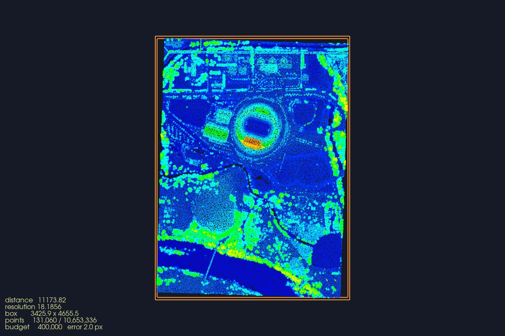
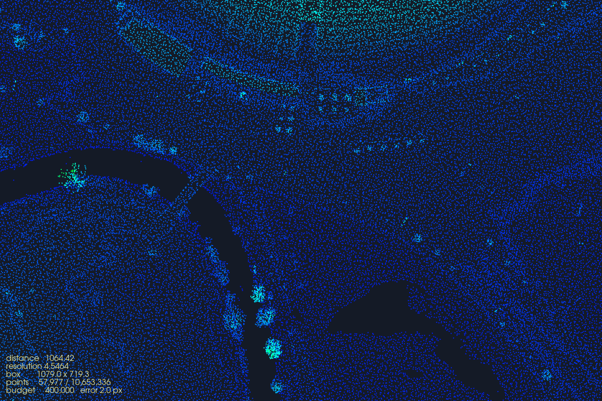

# Worked examples — C++ and Python

> [index](copc_laz_lod_tutorial.md) · [1. Format](copc_format.md) · [2. LOD mechanisms](copc_lod_mechanisms.md) · [3. PDAL](copc_pdal.md) · [4. VTK camera](copc_vtk_camera.md) · **5. Worked examples**

Six programs, each answering one question with real output: read the ladder
out of a file, cost a query before running it, load one box into VTK, and let
the camera drive the whole thing — locally and over HTTP.

---

## 8. Worked example: reading the LOD ladder out of a real file

**`copc_hierarchy_inspect`** — [src/copc_hierarchy_inspect.cpp](../src/copc_hierarchy_inspect.cpp)

If only one thing in this document gets run, make it this one. It answers the
question *"who decides the levels?"* by showing you that **they are already in
the file**. It has **no dependencies at all** — no PDAL, no VTK, no LAZ decoder —
because it never decompresses a point. It reads the LAS header, the `copc info`
VLR at its fixed offset, and the hierarchy pages. That is it.

```
g++ -std=c++17 -O2 -o copc_hierarchy_inspect src/copc_hierarchy_inspect.cpp
```

Get a real file to point it at:

```
curl -LO https://raw.githubusercontent.com/PDAL/PDAL/master/test/data/copc/lone-star.copc.laz
./copc_hierarchy_inspect lone-star.copc.laz
```

Real output, trimmed:

```
=== LAS HEADER ===============================================
LAS version          : 1.4
Point record format  : 6  (LAZ compressed)
Number of points     : 518862
File size            : 2705193 bytes (2.580 MB)
Scale                : 0.000250000, 0.000250000, 0.000250000
Bounding box X       : 515368.602 ... 515401.043   (32.441 wide)
Bounding box Y       : 4918340.364 ... 4918381.124   (40.760 wide)
Bounding box Z       : 2322.896 ... 2338.575   (15.679 wide)

-> All of the above came from the first 375 bytes.
```

**That is the first thing to internalize about partial loading.** The extent and
the point count of a 500 GB cloud cost 375 bytes to learn. A viewer can place its
camera, size its grid and plan its first query before touching any point data.

```
=== COPC INFO VLR ============================================
Root cube center     : 515388.9821, 4918360.7439, 2343.2761
Root cube halfsize   : 20.3799
Root cube extent     : 515368.6022 ... 515409.3620  (cubic in X, Y and Z)
Root node spacing    : 0.3184   <-- the base of the LOD ladder
Hierarchy at         : offset 2704713, 480 bytes
```

**This is the answer to "how is the LOD set".** One number — `spacing` — in a
160-byte VLR. Everything else is `spacing / 2^level`:

```
  level    spacing
  -----    ---------
      0       0.3184
      1       0.1592
      2       0.0796
      3       0.0398
      4       0.0199
      5       0.0100
```

Nobody at render time picks these. **The COPC writer picked them when the file was
created**, by choosing a target points-per-node, and they are then fixed forever.
A viewer's only freedom is *which levels to fetch* — never what the levels are.

Then the octree contents, read from the 480-byte hierarchy page:

```
=== OCTREE CONTENTS ==========================================
Hierarchy pages read : 1
Nodes with points    : 15

 level   nodes      points    spacing   avg pts/node   cumulative pts
 -----   -----   ---------   --------   ------------   --------------
     0       1       58393     0.3184          58393            58393
     1       4      105600     0.1592          26400           163993
     2      10      354869     0.0796          35486           518862

Total points in octree : 518862
Header point count     : 518862
```

The last two lines agreeing is the proof that the parse is right: every point in
the file is accounted for by exactly one node.

Read the `cumulative` column as the LOD pyramid. Draw level 0 only → 58 393
points, 11 % of the file, and you already have a recognizable cloud. Add level 1
→ 163 993. Add level 2 → everything. **Additive, never redundant.**

### The query simulator — partial loading, costed in advance

The `--bounds` and `--resolution` flags make the program walk the node list and
tell you what a query *would* cost, still without decompressing anything:

```
$ ./copc_hierarchy_inspect lone-star.copc.laz \
      --bounds 515370,515380,4918340,4918350 --resolution 0.1

=== SIMULATED QUERY ==========================================
bounds     : ([515370.000,515380.000],[4918340.000,4918350.000])
resolution : 0.100
-> deepest level needed : 2  (spacing 0.080)

Nodes touched        : 2 of 15
  culled by bounds   : 13
  culled by depth    : 0

Points in those nodes: 91302 of 518862   (17.60 %)
Bytes read           : 591170 of 2705193   (21.85 %)
Range requests       : 4   (header + root hierarchy page + one per node)
```

**13 of 15 nodes were eliminated by arithmetic on their keys.** Their bytes were
never touched. Over HTTP this is 4 range requests against a static file.

> **A node is the smallest unit of I/O, and that is not the same as the answer.**
> `points in those nodes` is an *upper bound*: you always decompress whole
> nodes, and then PDAL (or laspy) **crops** the result to your box. For this
> query laspy actually returns **7 360** points, not 91 302 — the box is small
> next to a level-0 node that spans the entire dataset. The number that is
> exact, and the one that actually costs you, is `bytes read`. Run the Python
> version with `--load` to see both side by side.

Now hold the bounds still (the whole extent this time) and move only
`resolution`, and you can watch the depth cut do its work:

```
resolution 0.35  ->  level 0    58393 pts (11.25 %)    431475 bytes (15.95 %)
resolution 0.2   ->  level 1   163993 pts (31.61 %)   1061773 bytes (39.25 %)
resolution 0.1   ->  level 2   518862 pts (100.0 %)   2703294 bytes (99.93 %)
no resolution    ->  all       518862 pts (100.0 %)   2703294 bytes (99.93 %)
```

(Bounds here are the whole extent, so no cropping happens and the point counts
are exact.)

Two knobs, two independent prunings:

| Knob | Prunes | Mechanism |
|---|---|---|
| `bounds` | **in space** | node AABB (computed from the key) vs. the query box |
| `resolution` | **in depth** | `spacing/2^level` vs. the requested spacing |

Both are decided from the index alone, *before* any I/O on point data. That is
the whole trick, and there is nothing more to it.

---

## 8a. The same thing in Python — and over HTTP

**`python/copc_hierarchy_inspect.py`** — the twin of the C++ inspector, plus the
one capability that is awkward in C++ and trivial here: **it works on a URL.**

The core needs **nothing but the standard library**, so it runs in Anaconda's
`base` with no install:

```
python python/copc_hierarchy_inspect.py lone-star.copc.laz
```

Only the optional `--load` flag needs packages:

```
conda env create -f python/environment.yml && conda activate copc
# or, into an env you already have:
conda install -c conda-forge laspy lazrs numpy python-pdal vtk
```

### Inspecting a remote file without downloading it

Every read goes through a `ByteSource` that counts bytes and requests, and the
HTTP implementation is just a `Range:` header. Point it at an 81 MB file on S3:

```
$ python python/copc_hierarchy_inspect.py \
    https://s3.amazonaws.com/hobu-lidar/autzen-classified.copc.laz
```

```
Number of points     : 10,653,336
File size            : 81,123,042 bytes (77.36 MB)

Root node spacing    : 36.3712   <-- the base of the LOD ladder

 level   nodes       points    spacing   avg pts/node   cumulative
 -----   -----   ----------   --------   ------------   ----------
     0       1       61,201    36.3712         61,201       61,201
     1       4       69,859    18.1856         17,464      131,060
     2      12      446,577     9.0928         37,214      577,637
     3      48    1,504,879     4.5464         31,351    2,082,516
     4     192    8,380,771     2.2732         43,649   10,463,287
     5      21      190,049     1.1366          9,049   10,653,336

Total points in octree : 10,653,336
Header point count     : 10,653,336
-> they match, so every point is accounted for by exactly one node.

=== WHAT THIS SCRIPT ACTUALLY READ ===========================
Requests             : 2
Bytes read           : 9,485 of 81,123,042  (0.0117 %)
Points decompressed  : 0
```

**Two HTTP requests and 9,485 bytes** bought the complete octree structure of a
10.6-million-point cloud: how many levels, how many nodes, where each one is in
space, and what each costs to fetch. Against a *static file* — no server
software, no database, no tiling step. That is the whole deployment story for
COPC, and it is the concrete difference from a plain `.laz`, which would have
required all 81 MB.

Note the shape of that table, because it is typical and the C++ example's tiny
file does not show it: levels 0–3 together are under 20 % of the points. A
viewer can draw a perfectly recognizable Autzen stadium from ~2 M points while
the remaining 8.4 M stream in — or never load at all if the camera stays far
away.

### `--ladder`: every LOD at once

```
$ python python/copc_hierarchy_inspect.py <url> \
      --ladder --bounds 636000,636500,850000,850500

 resolution    level    node points    % of file        bytes   % of file
 ----------    -----   ------------   ----------   ----------   ---------
    36.3712        0         61,201        0.57 %      763,258       0.94 %
    18.1856        1         86,830        0.82 %    1,093,022       1.35 %
     9.0928        2        165,338        1.55 %    1,902,701       2.35 %
     4.5464        3        313,282        2.94 %    3,242,517       4.00 %
     2.2732        4        768,175        7.21 %    6,526,749       8.05 %
     1.1366        5        812,085        7.62 %    6,897,746       8.50 %
     (none)      all        812,085        7.62 %    6,897,746       8.50 %
```

A 500 × 500 m window of a 3.4 × 4.6 km cloud, at six detail levels: from 0.57 %
of the file to 7.6 %. **Both knobs are working at once here** — the bounds cut
it to that window, the resolution picks the rung.

### `--load`: check the prediction against reality

```
$ python python/copc_hierarchy_inspect.py lone-star.copc.laz \
      --bounds 515370,515380,4918340,4918350 --resolution 0.1 --load

Points in those nodes: 91,302 of 518,862   (17.60 %)
Bytes to read        : 591,170 of 2,705,193   (21.85 %)

=== ACTUAL LOAD (laspy) ======================================
laspy returned       : 7,360 points
actual X range       : 515370.000 ... 515380.000
actual Y range       : 4918345.074 ... 4918349.999
numpy array          : (7360, 3), 0.17 MB
```

**91,302 predicted, 7,360 returned — and both are right.** This is the
distinction that trips people up:

| Figure | What it is |
|---|---|
| `bytes to read` | **Exact.** Whole LAZ chunks. This is what leaves the disk or the network. |
| `points in those nodes` | **Upper bound.** Everything inside the chunks you had to decompress. |
| what laspy/PDAL returns | The subset of those that actually fall inside your box. |

A node is the smallest unit of I/O, so you pay for whole nodes and *then* crop.
Here the box is 10 × 10 m while the level-0 node spans the entire 40 m dataset,
so almost everything read gets discarded. **Make your query boxes comparable to
the node size** and the gap closes; ask for a 1 m box out of a 4 km cloud and
you will decompress a great deal to keep very little.

`--json` emits the same structure machine-readably, which is the useful form if
you are picking LODs in a pipeline rather than reading them.

---

## 9. Worked example: load one box into VTK and nothing else

**`copc_partial_load_vtk`** — [src/copc_partial_load_vtk.cpp](../src/copc_partial_load_vtk.cpp)
(needs `-DUSE_PDAL=ON`)

This is the practical version of the same thing: PDAL does the traversal, and
the points land in a `vtkPolyData`.

```
# header only -- extent and count, no points
./copc_partial_load_vtk big.copc.laz --info

# one box, full detail
./copc_partial_load_vtk big.copc.laz --bounds 515370,515390,4918350,4918370

# same box, coarse
./copc_partial_load_vtk big.copc.laz --bounds 515370,515390,4918350,4918370 --resolution 0.5

# the same box at five LODs, no window
./copc_partial_load_vtk big.copc.laz --fraction 0.2 --ladder
```

The partial load is four PDAL calls. This is genuinely all of it:

```cpp
pdal::Stage *reader = factory.createStage("readers.copc");

pdal::Options options;
options.add("filename", filename);
options.add("bounds",   "([515370,515390],[4918350,4918370])");  // WHERE
options.add("resolution", 0.5);                                   // HOW DETAILED
reader->setOptions(options);

pdal::PointTable table;
reader->prepare(table);
pdal::PointViewSet views = reader->execute(table);
```

`execute()` returns only the points inside that box at that spacing. Nothing
else was ever allocated.

The header peek that precedes it is worth noting, because it is what lets you
decide the box in the first place:

```cpp
const pdal::QuickInfo qi = reader->preview();   // header read, no points
qi.m_bounds.minx / maxx / miny / maxy / minz / maxz;
qi.m_pointCount;
```

Then PDAL's columnar layout becomes VTK's interleaved one — the one piece of
genuine glue code in the whole stack:

```cpp
for (pdal::PointId i = 0; i < view->size(); ++i)
{
    const double x = view->getFieldAs<double>(pdal::Dimension::Id::X, i);
    const double y = view->getFieldAs<double>(pdal::Dimension::Id::Y, i);
    const double z = view->getFieldAs<double>(pdal::Dimension::Id::Z, i);

    const vtkIdType id = points->InsertNextPoint(x, y, z);
    vertices->InsertNextCell(1, &id);   // one vertex cell per point,
    elevation->InsertNextValue(z);      // or the mapper draws nothing
}

polyData->SetPoints(points);
polyData->SetVerts(vertices);
polyData->GetPointData()->SetScalars(elevation);
```

The `SetVerts` line is the one everybody forgets. A `vtkPolyData` with points
but no cells renders as an empty window.

`--ladder` prints the point count, the share of the file, the resulting RAM and
the wall time for five resolutions over identical bounds — the same table as
§8, but with the points actually in memory this time.

---

## 9a. The partial load in Python, with VTK

**`python/copc_partial_load_vtk.py`** — the Python twin of §9, and the easiest
way to see partial loading actually happen.

```
conda env create -f python/environment.yml && conda activate copc
# or: conda install -c conda-forge laspy lazrs numpy vtk
```

It differs from the C++ version in three useful ways:

* **it works on a URL**, so you can render a window of a cloud on S3;
* it **predicts the query's cost from the index first** (by importing
  `copc_hierarchy_inspect.py`) and then reports predicted vs. actual;
* it renders **offscreen to a PNG**, so it is usable over SSH and in CI.

`laspy.CopcReader` performs the query by default; `--backend pdal` runs the same
thing through PDAL for parity with the C++ examples.

### Seeing the LOD

Same 500 × 500 m box out of Autzen (3.4 × 4.6 km, 10.6 M points, 77 MB on S3).
Only `--resolution` differs:

```
python python/copc_partial_load_vtk.py \
    https://s3.amazonaws.com/hobu-lidar/autzen-classified.copc.laz \
    --bounds 636000,636500,850000,850500 --resolution 8 \
    --offscreen --screenshot coarse.png
```

| `--resolution 8` — 49,783 points, 0.47 % of the file, 4.00 % of the bytes | `--resolution 1` — 263,353 points, 2.47 % of the file, 8.50 % of the bytes |
|---|---|
|  |  |

Identical bounds, identical code, one option changed. The orange wireframe is
the query box; the grey one is the full dataset extent, which mostly runs off
screen because the query is 1.57 % of it.

### Predicted vs. actual

The run prints both, which is where the octree stops being abstract:

```
=== QUERY ===================================================
bounds     : ([636000.000,636500.000],[850000.000,850500.000])
             500.000 x 500.000 units (1.57 % of the extent)
resolution : 2.0

Predicted from the index:
  nodes to read    : 22 of 278   (256 culled by bounds, 0 by depth)
  deepest level    : 5 (spacing 1.1366)
  bytes to read    : 6,897,746 of 81,123,042   (8.50 %)
  points in those nodes: 812,085  (upper bound -- the reader then crops)

Actual (laspy):
  points loaded    : 263,353 of 10,653,336   (2.47 %)
  coordinate array : 6.03 MB
  load time        : 2.318 s
  kept / read      : 32.4 % of the points that had to be decompressed

-> 263,353 points are in memory. The other 10,389,983 were never
   allocated, and never downloaded.
```

**256 of 278 nodes were eliminated before any I/O**, by arithmetic on their
keys. Of the 22 that survived, ~8.5 % of the file's bytes were fetched over
HTTP, and a third of the points inside them were kept. That "kept / read" ratio
is the practical number to watch: it is the price of nodes being the unit of
I/O, and it improves as your query box approaches the node size.

### numpy → VTK

The one piece of real glue, and the same trap as in C++ — **points with no
vertex cells render an empty window**:

```python
points = vtk.vtkPoints()
points.SetData(numpy_to_vtk(np.ascontiguousarray(xyz, dtype=np.float64), deep=True))
polydata.SetPoints(points)

# a vtkCellArray of verts wants [1, i0, 1, i1, 1, i2, ...]
connectivity = np.empty((count, 2), dtype=np.int64)
connectivity[:, 0] = 1
connectivity[:, 1] = np.arange(count, dtype=np.int64)

cells = vtk.vtkCellArray()
cells.SetCells(count, numpy_to_vtkIdTypeArray(connectivity.ravel(), deep=True))
polydata.SetVerts(cells)
```

Building the connectivity with numpy rather than a Python loop matters: at a
few hundred thousand points, `InsertNextCell` in a Python `for` loop is the
slowest thing in the program by a wide margin.

Two VTK-Python differences worth knowing, both hit while writing this:

* `vtkRenderer.AddActor2D` is **not exposed** in the Python bindings even though
  `vtkViewport::AddActor2D` exists in C++. Use `AddViewProp`, which takes 2D and
  3D props alike.
* `vtkScalarBarActor` scales its title to the bar's bounding box, so a default
  scalar bar renders a "Z" the size of the window. Call
  `UnconstrainedFontSizeOn()` and set the title/label font sizes explicitly.

---

## 10. Worked example: let the camera decide

**`copc_camera_streaming`** — [src/copc_camera_streaming.cpp](../src/copc_camera_streaming.cpp)
(needs `-DUSE_PDAL=ON`)

Here nothing is hard-coded. Every time you release the mouse, the viewer
re-derives *both* query options from the camera and reloads.

```
./copc_camera_streaming big.copc.laz --budget 500000 --error 2.0
```

### WHERE: frustum → bounds

```cpp
double planes[24];
camera->GetFrustumPlanes(aspect, planes);

vtkNew<vtkPlanes> frustumPlanes;
frustumPlanes->SetFrustumPlanes(planes);

vtkNew<vtkFrustumSource> frustum;
frustum->SetPlanes(frustumPlanes);
frustum->Update();

double b[6];
frustum->GetOutput()->GetBounds(b);      // AABB of the visible volume

Box2D box = {b[0], b[1], b[2], b[3]};
box.clampTo(FullExtent);                 // never ask outside the data
```

Using the frustum's axis-aligned bounds is deliberately *conservative* — it asks
for a bit more than is strictly visible. That is the right error to make: too
little and points pop in at the screen edge as you pan.

### HOW DETAILED: screen-space error → resolution

This is the inverse of the projection formula from [§6](copc_vtk_camera.md), and it is the entire
LOD decision in three lines:

```cpp
const double focalLengthPixels = height / (2.0 * std::tan(fovRad * 0.5));
const double distance          = |focalPoint - position|;

resolution = TargetPixelError * distance / focalLengthPixels;
```

Read it out loud: *"I am willing to let points sit 2 pixels apart on screen; at
this distance, 2 pixels is this many metres; give me points that far apart."*

Move closer → `distance` shrinks → `resolution` shrinks → PDAL descends deeper.
**Nobody ever names a level.** The level is whatever the octree walk reaches
before its node spacing gets finer than the number that fell out of that
division. `TargetPixelError` is the only quality dial in the program, and it is
in pixels — a unit a human can actually reason about.

(The orthographic branch drops `distance` entirely and uses
`2 * ParallelScale / height`, since size on screen is distance-independent there.)

### The guard rails

Three things separate this from a toy:

* **Budget, enforced from the index.** The viewer parses the COPC octree itself
  (`src/copc_index.hpp`) and costs every candidate level against the visible box
  *before* querying, picking the deepest that fits `--budget`. Every camera move
  therefore costs **exactly one** PDAL query. See §10a for why this replaced a
  query-and-retry loop, and what it costs in conservatism.
* **Debounce.** The reload runs on `EndInteractionEvent` — mouse release — not on
  `ModifiedEvent`, which fires continuously during a drag. It also skips the
  query entirely if the box moved less than 20 % of its own size and the
  resolution changed by less than 25 %.
* **No actor churn.** It calls `mapper->SetInputData(newPolyData)` on the
  existing actor. The camera is never reset, so the view stays exactly where you
  put it.

Every cycle prints its full reasoning:

```
CAMERA
  distance to focal point : 61.235
  focal length            : 1493.045 px

DERIVED QUERY
  visible box   : ([515366.1,515411.9],[4918338.2,4918383.3])
  resolution    : 0.08202  (= 2.000 px * 61.235 / 1493.045)

RESULT
  points loaded : 421883  (81.31 % of the file)
  load time     : 0.214 s
```

Zoom in and watch: the resolution number falls, the box shrinks, and **the point
count stays roughly flat**. That flatness is what LOD buys you — constant cost
regardless of how big the file is or how close you get.

### What it still is not

Honest limits, so the gap to a production viewer is visible:

* The load is **synchronous**. It runs on mouse-release so the drag stays
  smooth, but a large query freezes the UI for its duration. A real viewer loads
  **per node** on a worker thread and appends nodes as they arrive.
* It reloads the **whole visible box** each time instead of diffing against
  what it already holds. There is no node cache, so panning re-fetches
  everything. [§7](copc_vtk_camera.md) sketches the version that does not.
* One `vtkPolyData` for everything, so VTK's own per-actor frustum culling has
  nothing to cull. One actor per node would fix that.

---

## 10a. The streaming loop in Python — and a smarter budget

**`python/copc_camera_streaming.py`** — the Python twin of §10, with one
genuine improvement over the C++ version that is worth understanding.

```
# interactive, local or remote
python python/copc_camera_streaming.py \
    https://s3.amazonaws.com/hobu-lidar/autzen-classified.copc.laz \
    --budget 400000 --error 2.5

# headless: fly a scripted zoom, print every decision, write a PNG per step
python python/copc_camera_streaming.py lone-star.copc.laz \
    --demo 5 --screenshot-prefix step
```

`--demo` is not a toy: it is how this loop gets tested without a human holding
the mouse. Each step dollies in 1.8× and runs a full decision cycle.

| step 0 — whole extent, level 1, 131,060 points | step 4 — 4.87 % of the extent, level 3, 57,977 points |
|---|---|
|  |  |

### The decision, printed

```
----- step 4 ------------------------------------------------
CAMERA
  distance to focal point : 1064.416
  focal length            : 1492.820 px

DERIVED QUERY
  visible box   : ([636751.250,637830.250],[850850.250,851569.562])
                  1079.0 x 719.3 units (4.87 % of extent)
  resolution    : 1.42605  (= 2.0 px * 1064.416 / 1492.820)
  index says    : level 5 would read 8,210,626 bytes
  budget picks  : level 3 -> 9 of 278 nodes, 2,974,047 bytes, <= 271,636 points
  (coarsened 2 level(s) to stay under 400,000; resolution now 4.54640)

RESULT
  points loaded : 57,977  (0.54 % of the file)
  load time     : 2.237 s
  queries made  : 1  (the level was chosen from the index)
```

Across the five steps the visible box goes 100 % → 4.87 % of the extent and the
derived resolution falls 14.97 → 1.43, while the loaded point count stays
between 50 k and 200 k. **That flatness is the whole payoff.** Cost tracks the
screen, not the file: the same loop behaves identically on an 80 MB file and an
80 GB one.

### Why the budget is enforced from the index

Both versions do this now, and the story of why is the useful part.

The obvious way to enforce a point budget is: query, notice the result is too
big, double the resolution, **query again**. That is what the C++ viewer did
first, and what the `--demo` run above was written to test. It costs a full
round trip per guess — and worse, doubling the resolution does not always change
the depth. In one run a retry came back with the **identical 472,796 points**: a
network query spent to learn nothing, after which the next doubling overshot to
58 k.

The fix is to hold the octree index in memory and **cost every candidate level
against this box in pure arithmetic**, picking the deepest that fits before any
point data moves. Python gets the index by importing
`copc_hierarchy_inspect.py`; C++ gets it from `src/copc_index.hpp`, the
dependency-free parser shared with `copc_hierarchy_inspect` (`copc::openIndex`,
`copc::costQuery`, `copc::chooseLevelForBudget`). The two implementations agree
exactly — same chosen level, node count, byte count and bound on the same file
and box.

In Python:

```python
wanted_level = cost_query(nodes, info, box, resolution).max_level

for level in range(wanted_level, -1, -1):
    candidate = cost_query(nodes, info, box, info.spacing_at(level))

    if candidate.points <= self.point_budget:
        chosen_level, cost = level, candidate
        break

# exactly ONE query, at a level we already know fits
loaded = load_laspy(source, box, info.spacing_at(chosen_level), zmin, zmax)
```

and the same thing in C++, where the loop lives in the shared header:

```cpp
const copc::BudgetChoice choice = copc::chooseLevelForBudget(
    Octree.nodes, Octree.info,
    box.xmin, box.xmax, box.ymin, box.ymax,
    resolution, PointBudget);

if (choice.chosenLevel < choice.wantedLevel)
    resolution = choice.resolution;

// exactly ONE query, at a level we already know fits
polyData = query(box, resolution, points, seconds);
```

Always one query, never over budget. This works because `cost_query` counts the
points inside the *nodes* that would be read, which is an **upper bound** on
what comes back after cropping (§8a) — so a level that fits by that measure is
guaranteed to fit for real.

The cost of that safety is visible in the numbers above: it picked level 3 with
a bound of 271,636 against a budget of 400,000, and the query actually returned
57,977. **It is conservative, and sometimes a whole level more conservative than
it needed to be.** Scaling the bound by how much of each node the box actually
overlaps would tighten it; erring toward "too few points" is the right default
in the meantime, because the alternative is a dropped frame.

**This is the real argument for keeping the hierarchy client-side.** A one-shot
`readers.copc` call is a black box: you ask, you wait, you find out. PDAL walks
the hierarchy on every `execute()` but does not hand it back, so the C++ viewer
parses it separately — 300 lines of `std::ifstream`, no dependencies. A viewer
that has the index can answer "what will this cost?" for any box at any level,
instantly and offline, and never issue a query it will regret. Everything in [§7](copc_vtk_camera.md)
— per-node loading, caching, prefetching, frame budgeting — depends on having
it.

### Still missing

Same honest gaps in both versions:

* The load is **synchronous**, on `EndInteractionEvent`. The drag stays smooth
  because nothing blocks during it, but a large query freezes the UI for its
  duration. Over HTTP that is ~2 s per step in the runs above.
* It reloads the **whole visible box** each time rather than diffing against
  what it already holds. No node cache, so panning re-fetches everything.
* One `vtkPolyData` for everything, so VTK's own per-actor culling has nothing
  to work with.

[§7](copc_vtk_camera.md) sketches the version that fixes all three.

