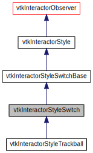

  


In the header:

```cpp
enum class INTERACTION_MODE { CAMERA, ACTOR };


class InteractorStyleSwitch  : public vtkInteractorStyleSwitchBase {
public:
  static InteractorStyleSwitch *New();

  void SetInteractor(vtkRenderWindowInteractor *iren) override;
  void SetDefaultRenderer(vtkRenderer *) override;
  void SetCurrentRenderer(vtkRenderer *) override;
  
  void OnChar() override;

  vtkRenderWindowInteractor *GetInteractor();

  void SetCurrentStyleToTrackballActor();
  void SetCurrentStyleToTrackballCamera();


private:
  InteractorStyleSwitch(const InteractorStyleSwitch &) = delete;
  void operator=(const InteractorStyleSwitch &) = delete;


  vtkSmartPointer<ActorManipulationInteractorStyle> m_trackballActorStyle;
  vtkSmartPointer<CameraInteractorStyle> m_trackballCameraStyle;

  vtkSmartPointer<vtkInteractorStyle> m_currentStyle;
};
```

In the cpp:

```cpp
void InteractorStyleSwitch::OnChar() {

  switch (Interactor->GetKeyCode()) {
  case 'c':
  case 'C':
    m_interactionMode = INTERACTION_MODE::CAMERA;
    EventCallbackCommand->SetAbortFlag(1);
    break;
  case 'a':
  case 'A':
    m_interactionMode = INTERACTION_MODE::ACTOR;
    EventCallbackCommand->SetAbortFlag(1);
    break;
  }
  SetCurrentStyle();
}


void InteractorStyleSwitch::SetCurrentStyle() {
  if (m_interactionMode == INTERACTION_MODE::CAMERA) {
    if (m_currentStyle != m_trackballCameraStyle) {
      if (m_currentStyle) {
        m_currentStyle->SetInteractor(nullptr);
      }
      m_currentStyle = m_trackballCameraStyle;
    }

  } else if (m_interactionMode == INTERACTION_MODE::ACTOR) {
    if (m_currentStyle != m_trackballActorStyle) {
      if (m_currentStyle) {
        m_currentStyle->SetInteractor(nullptr);
      }
      m_currentStyle = m_trackballActorStyle;
    }
  }
  if (m_currentStyle) {
    m_currentStyle->SetInteractor(Interactor);
    m_currentStyle->SetTDxStyle(TDxStyle);
  }
}
```

Now to use it:

```cpp
vtkNew<vtkRenderer> renderer;
vtkNew<vtkRenderWindow> winRen;
vtkNew<vtkRenderWindowInteractor> iRen;

vtkNew<InteractorStyleSwitch> style;

style->SetCurrentRenderer(renderer);

renderer->AddActor(actor);
winRen->AddRenderer(renderer);
iRen->SetInteractorStyle(style);

winRen->SetInteractor(iRen);
iRen->Start();
```


code [1](../src/InteractorStyleSwitch.cpp), [2](../src/InteractorStyleSwitchExample.cpp)


If you want to use it in QML applications:

```cpp

```


code: [1](../src/QtQuickCone.cpp)


source code of vtkInteractorStyleSwitch: [1](https://github.com/Kitware/VTK/blob/master/Interaction/Style/vtkInteractorStyleSwitch.h), [2](https://github.com/Kitware/VTK/blob/master/Interaction/Style/vtkInteractorStyleSwitch.cxx)
