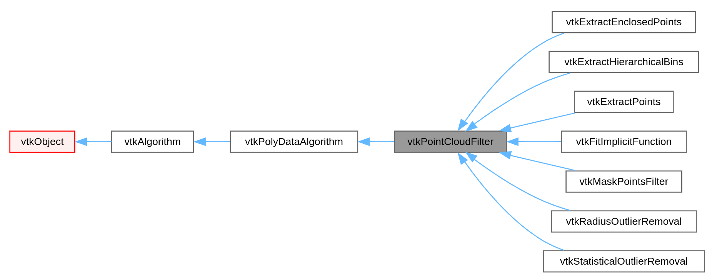

## vtkPointCloudFilter

 
 
### vtkRadiusOutlierRemoval
 
 
### vtkStatisticalOutlierRemoval

### vtkExtractPoints

### vtkExtractHierarchicalBins

### vtkFitImplicitFunction

`vtkFitImplicitFunction` extract points that are on the surface of an implicit function (within some threshold).

Refs: [1](https://vtk.org/doc/nightly/html/classvtkFitImplicitFunction.html#details)
