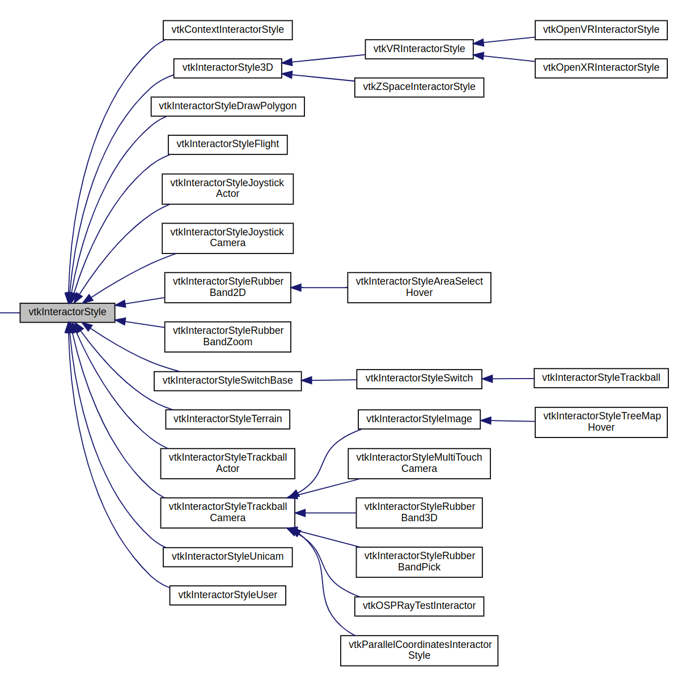

By default the `vtkRenderWindowInteractor` instantiates an instance of `vtkInteractorStyle`.

```cpp
vtkNew<vtkRenderWindow> renWin;
renWin->AddRenderer(renderer);

vtkNew<vtkRenderWindowInteractor> iren;
iren->SetRenderWindow(renWin);
```

We can specify a particular interactor style.

```cpp
vtkNew<vtkInteractorStyleTrackballCamera> style;
iren->SetInteractorStyle(style);
```
# vtkInteractorStyleTrackballCamera

Rotates camera around the object.
```cpp
vtkNew<vtkInteractorStyleTrackballCamera> style;
```


# vtkInteractorStyleTrackballActor
Rotates a single actor around camera focal point.

```cpp
vtkNew<vtkInteractorStyleTrackballActor> style;
```
List of the all available interaction style: 




[code](../src/setting_interaction_style.cpp)

Refs: [1](https://examples.vtk.org/site/Cxx/Tutorial/Tutorial_Step5/)
